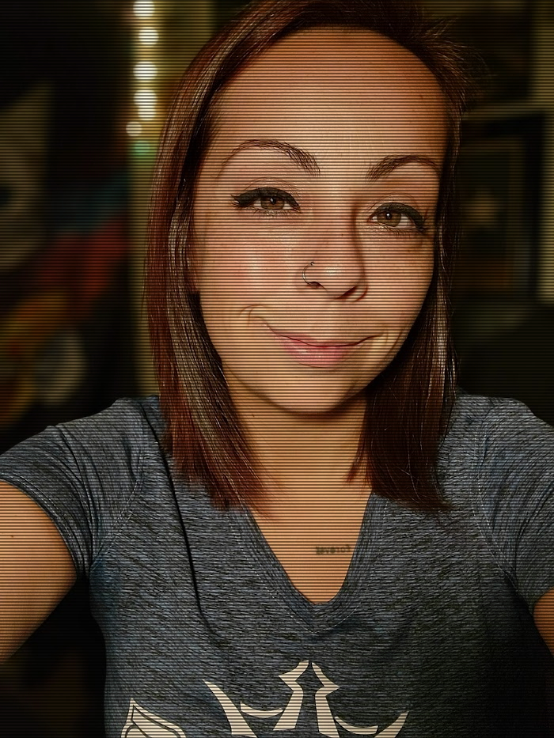

# About Mi

Welcome! I'm Mia. (Mi, DG Mi, hey you, whatever!) 

This space is where I explore self-compassion, personal growth, and disc golf - blending life lessons with the game I love. My journey is about learning, evolving, and embracing both victories and setbacks with kindness and grace.

I believe in the power of mindset, resilience, and the simple yet profound act of being kind to yourself. Whether you’re here for disc golf insights, personal reflections, or just a dose of shameless optimism, I’m glad you stopped by!

---

 

🌱 Why I Started This Blog
 
For most of my life, I’ve been on a path of constant growth — sometimes intentional, sometimes chaotic. I’ve learned that **self-compassion is the foundation for progress**, and I wanted a space to share that journey.

Disc golf has become a huge part of my life, not just as a sport but as a mirror for self-improvement. Through every throw, win, and misstep, I see reflections of persistence, self-doubt, and the power of showing up for myself.

This blog is a place to document those lessons, offer encouragement, and remind anyone reading that growth is never linear—but it’s always worth it.

 

💡 What You'll Find Here

 - **Personal reflections** on self-worth, resilience, and overcoming setbacks 
 - **Disc golf tournament experiences** and lessons learned on and off the course 
 - **Snapshots of my journey**, including struggles, breakthroughs, and everything in between 

 

🏆 My Disc Golf Journey
 
I’ve been competing in professional tournaments the past few years, constantly pushing myself to **play the course, not the competition** — though that’s easier said than done!

My goal is rarely to win (though, let’s be honest, that’s nice too 🥹), but to become the best version of myself through the sport. Disc golf has taught me patience, adaptability, and how to stay present.

I also track my disc golf progress meticulously, from tournament milestones to the exact lifespan of my discs. (Yes, spreadsheets are my love language. 🖤📊)

 

📊 My Other Passion Projects
 
Outside of disc golf, I love **tracking random data** and creating structured ways to measure growth. My **"Year of 36"** project is one of my biggest undertakings—an annual reflection and goal-setting system inspired by Groundhog Day Resolutions.

I've always got some ideas and new things I'd like to try up my sleeve...

🎭 Fun Facts About Me
 
- **Favorite disc golf course?** Mmm, this one's always up in the air. I'm never mad about making the trek to play [Dogwood](https://udisc.com/courses/lindsey-park-dgc-dogwood-yellow-Xv7q) or [The Beast](https://udisc.com/courses/brazos-park-east-the-b-east-uzjl).  
- **Most humbling tournament moment?** Ha - I could probably make a whole post on these alone. #StayHumble 
- **Biggest lesson learned this year?** Compassion starts with yourself. 
- **I love:** Skull designs, deep conversations, and breaking limiting beliefs. 

 

📄 View My Resume

[Download My Resume](/assets/files/Resume-Mia-Lofton.pdf) 

---

Let’s Connect!

I’d love to hear from you! Whether you want to chat about disc golf, personal growth, or just share your own journey, feel free to reach out.

- 📧 [E-mail](dgmi116281@gmail.com)
- [Facebook](https://www.facebook.com/dgmi116281)
- [Instagram](https://www.instagram.com/dgmi_/)
- [PDGA 116281](https://www.pdga.com/player/116281)
